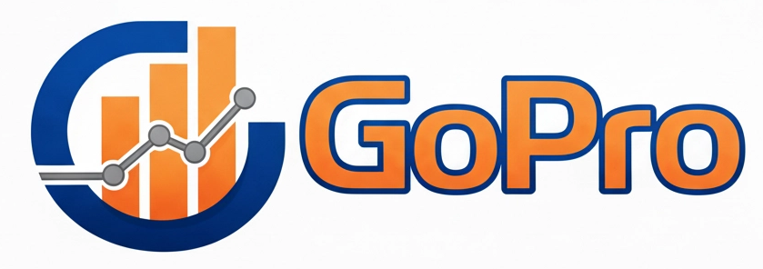

# 📚 Projeto de Extensão: GoPro  

  

**Grupo de Extensão em Gestão de Operações, Programação e Pesquisa Operacional**

---

## 📌 Resumo
Os problemas de gestão de operações e logística, tradicionalmente estudados na Pesquisa Operacional, oferecem um campo fértil para a aplicação de técnicas de modelagem matemática e algoritmos de otimização.  

No contexto extensionista, o projeto **GoPro** busca aproximar os estudantes da Engenharia de Produção da UFC dessas metodologias, promovendo experiências práticas de programação e resolução de problemas clássicos e contemporâneos da área.  

Ao longo dos encontros, os participantes terão contato com desafios como:
- Roteamento de veículos  
- Planejamento da produção  
- Sequenciamento  
- Previsão de demanda  

Essa abordagem favorece a integração entre ensino, pesquisa e extensão, permitindo que os alunos desenvolvam competências técnicas e analíticas, ao mesmo tempo em que constroem soluções colaborativas e dialogam com diferentes comunidades de saberes.  

---

## 🎯 Justificativa
A Engenharia de Produção demanda profissionais capazes de integrar conhecimentos de gestão, modelagem matemática e ferramentas computacionais para resolver problemas complexos. Muitos alunos, entretanto, têm pouco contato prático com softwares e metodologias de otimização aplicadas a casos reais.  

A Pesquisa Operacional (PO) é uma área dedicada à aplicação de métodos analíticos avançados para apoiar a tomada de decisões em contextos complexos. Quando aplicada de forma adequada, gera benefícios significativos para organizações e sociedade, otimizando processos e recursos.  

O projeto GoPro busca atender a essa necessidade, oferecendo um espaço de aprendizado ativo e colaborativo, no qual os estudantes aplicam programação e pesquisa operacional em desafios de gestão de operações, fortalecendo sua formação acadêmica e ampliando o vínculo entre ensino e extensão universitária.  

---

## 🎯 Objetivos
**Objetivo Geral:**  
Promover a integração entre programação computacional, pesquisa operacional e gestão de operações, por meio de atividades extensionistas que ofereçam aos estudantes da Engenharia de Produção da UFC um espaço de aprendizado ativo e colaborativo.  

**Objetivos Específicos:**  
- Desenvolver atividades práticas de modelagem matemática e programação aplicadas à gestão da produção e operações.  
- Implementar algoritmos e ferramentas computacionais para resolver problemas clássicos e contemporâneos.  
- Realizar estudos de caso e projetos aplicados, aproximando os estudantes de situações reais.  
- Incentivar a produção acadêmica e a divulgação científica por meio de relatórios, artigos e apresentações.  

---

## 📊 Indicadores e Resultados Esperados
- **Participação Estudantil**  
  - Quantitativo: pelo menos 30 estudantes ao longo de 12 meses.  
  - Qualitativo: engajamento avaliado por questionários e relatos de experiência.  

- **Produção Acadêmica e Técnica**  
  - Quantitativo: mínimo de 3 produtos acadêmicos (relatórios, artigos, trabalhos).  
  - Qualitativo: relevância e qualidade percebida por professores e pares.  

- **Desenvolvimento de Competências Práticas**  
  - Quantitativo: pelo menos 6 oficinas/minicursos/sessões práticas.  
  - Qualitativo: evidências de aprendizado verificadas por exercícios e autoavaliação.  

---

## 🗓️ Cronograma de Atividades
**Duração:** Dois semestres letivos (8 meses)  

- **Mês 1:** Problemas de Corte e Empacotamento  
- **Mês 2:** Problemas de Planejamento da Produção  
- **Mês 3:** Problemas de Sequenciamento da Produção  
- **Mês 4:** Problemas de Logística e Transportes  
- **Mês 5:** Problemas de Agrupamento e Localização  
- **Mês 6:** Problemas de Planejamento de Projetos  
- **Mês 7:** Problemas de Previsão de Demanda (Séries Temporais)  
- **Mês 8:** Workshops e escolha dos trabalhos premiados  

**Premiação Final:**  
- Primeiro Lugar  
- Segundo Lugar  
- Terceiro Lugar  
- Menção Honrosa  

---

👩‍🎓 **Universidade Federal do Ceará (UFC)**  
📍 Curso de Engenharia de Produção  
📅 Período: 2 semestres letivos (8 meses)  
